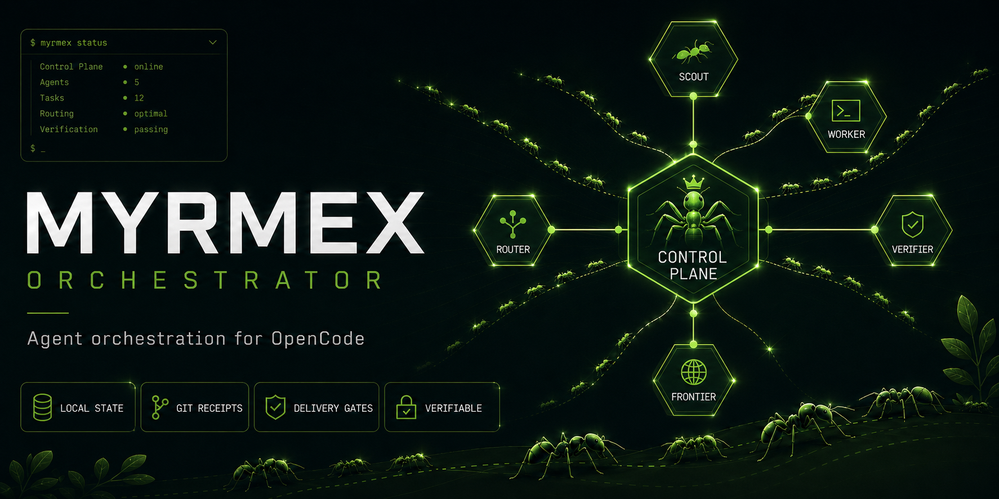

  

# Myrmex Orchestrator for OpenCode

Myrmex is an independent open-source agent stack focused exclusively on
OpenCode. It executes, delegates, verifies, and coordinates frontier work with
durable local state and explicit delivery gates.

Status: alpha, version 0.1.0-alpha.1. The supported baseline is Linux with
OpenCode 1.18+, Python 3.10+, and Bash. Node 18+ is required for DOM/browser
tests. The live frontier route is not claimed as validated until its manual
smoke test has been run.

## What it installs

- Primary agent: myrmex-orchestrator, DIRECT by default.
- Subagents: myrmex-scout, myrmex-worker, myrmex-verifier, and myrmex-frontier.
- Skills: local delegation, frontier delegation, semantic memory policy, and
  separate Git delivery gates.
- myrmex-state: dependency-free atomic state for phases, locks, request/task
  IDs, digests, delegation ledger, correction budgets, and receipts.
- JSON contracts, prompts, recovery references, installer rollback, diagnostics,
  tests, CI, and reproducible release tooling.

## Routes

DIRECT is the default for clear, bounded, reversible work.

DELEGATED uses one bounded writer and an independent verifier when fresh context
or multi-layer evidence materially helps. A work unit permits at most one scout,
one active writer, and one verifier. Corrections are bounded at two attempts and
must show concrete defect progress.

FRONTIER is explicit. The browser transport is isolated and never edits the
repository; myrmex-state remains authoritative for exact recovery.

## Install

Extract the release archive and run:

    ./scripts/run-tests.sh
    ./scripts/preflight.sh
    ./scripts/install.sh
    ./scripts/verify-install.sh

Restart OpenCode, select myrmex-orchestrator, and run /myrmex-doctor. Do not set
it as the default or authorize push until the staged rollout in
docs/OPERATIONS.md has passed.

For an installation performed by another agent, use PROMPT-INSTALL-MYRMEX.md.
The live frontier smoke test is separate and requires a browser profile already
authenticated by the user.

## Provider and agent policy

Delegated agents require a resolved model. The default policy permits model
identifiers with the openai/ provider prefix, blocks silent fallback, and
reports local-over-global agent shadowing. Configure additional prefixes
explicitly in myrmex.json when required.

The resolver reports effective source, global source, shadowing, model, provider,
and bounded steps. It emits PASS_AGENT_RESOLUTION, WARN_SHADOWED_AGENT,
AGENT_MODEL_UNRESOLVED, BLOCKED_NON_ALLOWED_PROVIDER, and
FAIL_INVALID_AGENT_STEPS.

## Security and delivery

Environment files and secrets are denied by agent permissions. Pre-existing dirty
paths are protected. Workers cannot delegate, write memory, commit, or push;
verifiers cannot edit. Commit and push are separate authorizations. Force push,
hard reset, destructive clean, and sudo are denied.

Git receipts are collected by scripts/collect-git-evidence.py and reconciled
against Git by scripts/verify-receipt.py. Mismatches produce
FAIL_RECEIPT_MISMATCH. Changed lines use a soft 400-line limit: larger cohesive
changes require a complete size exception rather than removing tests or docs.

## Structure

    agents/       OpenCode agent definitions
    skills/       Myrmex skills and frontier assets
    commands/     slash commands
    contracts/    canonical JSON schemas
    bin/          myrmex-state
    docs/         architecture, security, and operations
    scripts/      install, diagnostics, tests, evidence, and release builder
    profiles/     optional defaults and configuration examples

See README.es.md for Spanish documentation. Licensed under Apache-2.0.
